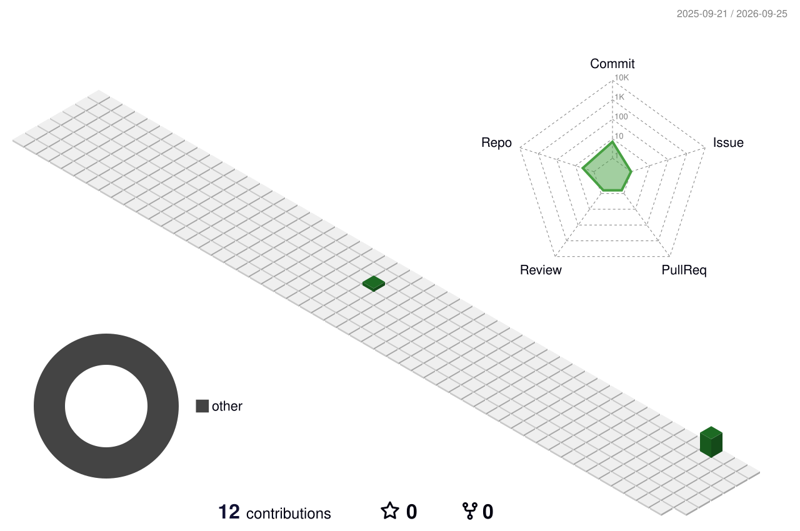

 

 
 

## 📊 Stats

 

 

 

## 🐍 Contribution Snake

<picture>
  <source media="(prefers-color-scheme: dark)" srcset="./github-contribution-grid-snake-dark.svg" />
  <source media="(prefers-color-scheme: light)" srcset="./github-contribution-grid-snake.svg" />
  
</picture>

 

## 🧊 3D Contributions

 

## 🏆 Trophy

 

## 🚀 Featured Projects

 
 

